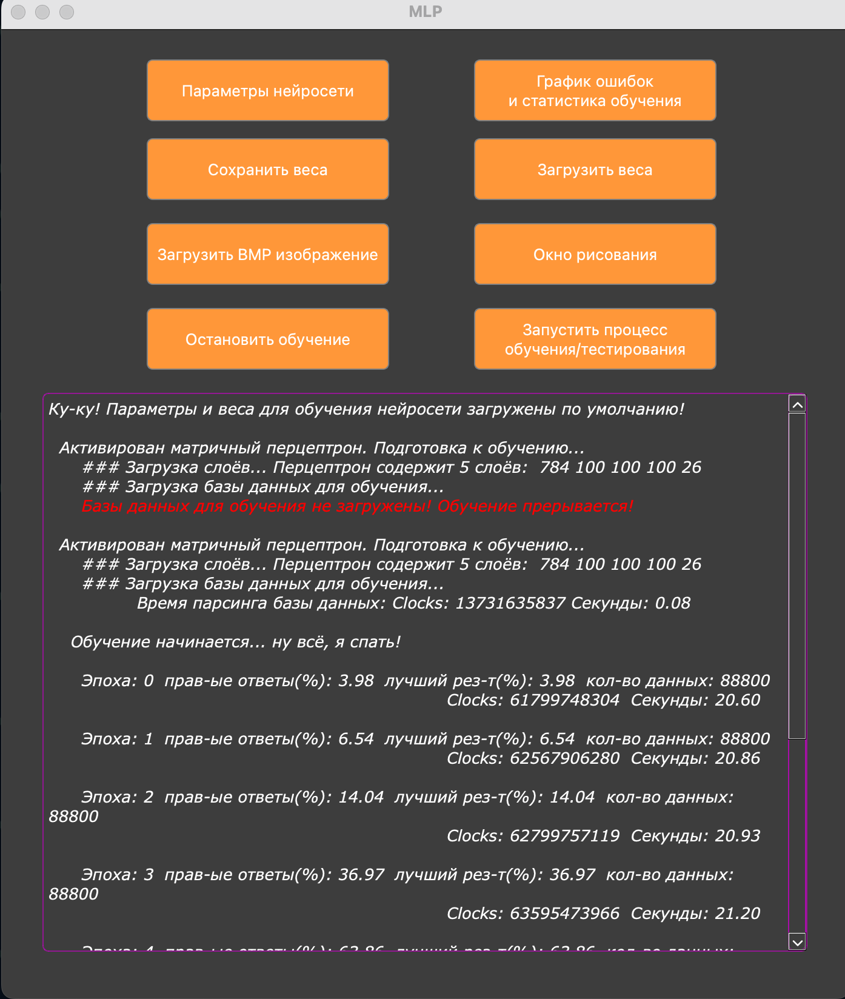
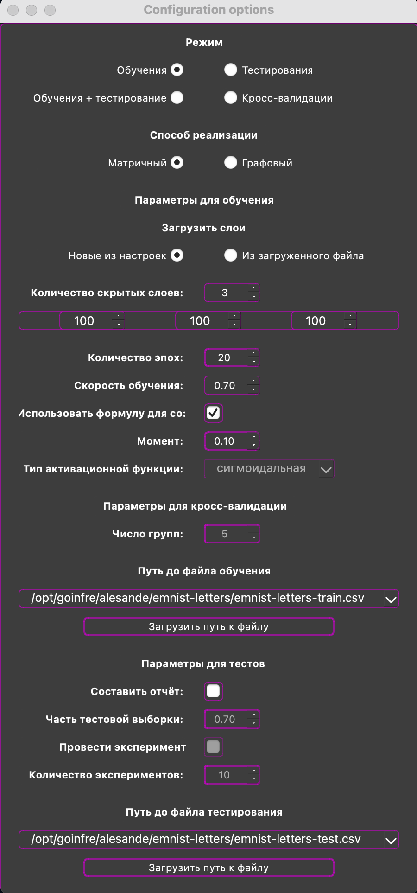

<!DOCTYPE html>
<html>

<head>
    <title>MLP (C++ | QT)</title>
</head>

<body>

# MLP (C++ | QT)

## Описание

    
    

**Программа позволяет/решает:**
- формировать и обучать модели нейронных сетей для классификации рукописных букв латинского алфавита
- запустить эксперимент на тестовой выборке или ее части, задаваемой дробным числом от 0 до 1 (где 0 - это пустая выборка - вырожденная ситуация, а 1 - вся тестовая выборка целиком). После выполнения эксперимента на экран должно быть выведена средняя точность (average accuracy), прецизионность (precision), полнота (recall), f-мера (f-measure) и общее затраченное время
- загружать BMP-изображения (размер изображения может достигать 512x512) с буквами латинского алфавита и осуществлять их классификацию
- рисовать двухцветные квадратные изображения от руки в отдельном окне
- запускать процесс обучения в реальном времени для заданного пользователем количества эпох с выводом на экран контрольных значений ошибки для каждой эпохи обучения. Предусмотреть возможность составление отчета в виде графика изменения ошибки, посчитанной на тестовой выборке, для каждой эпохи обучения
- запускать процесс обучения с применением кросс-валидации для заданного числа групп k
- переключать реализацию перцпетрона (матричная или графовая)
- переключать количество скрытых слоев перцептрона (от 2 до 5)
- сохранять в файл и загружать из файла веса перцептрона

**Установка/запуск:**
- make init_b MLP